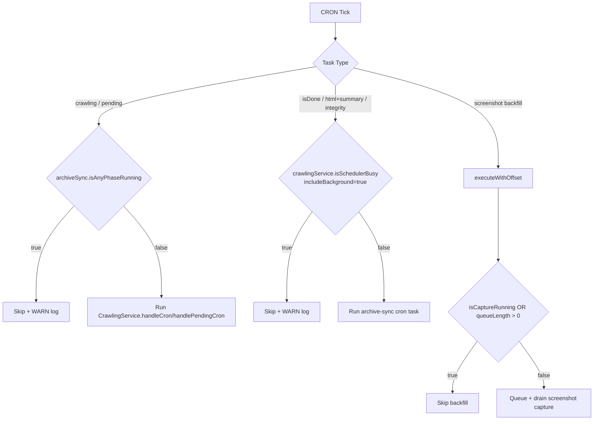
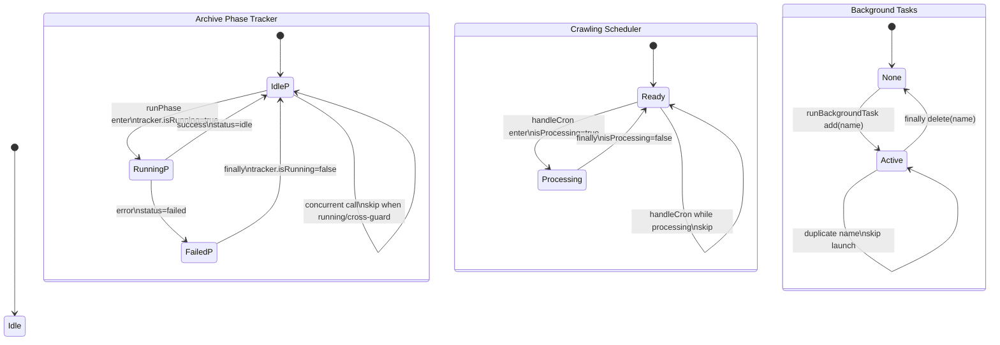
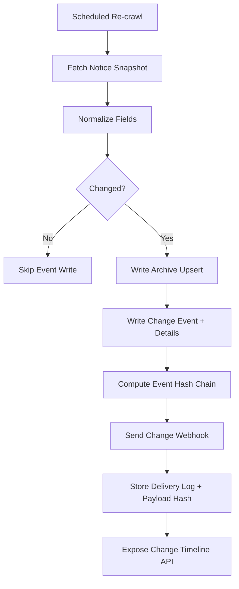

# LawCast Backend

NestJS 기반 API 서버입니다. 국회 입법예고(PAL)와 국민참여입법센터(NSM) 데이터를 수집/동기화하고, 아카이브 저장, 요약 생성, Discord 웹훅 알림, 운영용 디버그 브릿지를 제공합니다.

## 주요 기능

- PAL/NSM 크롤링 기반 입법예고 수집
- 아카이브 영속화(SQLite + TypeORM) 및 무결성(SHA-256) 검증
- NSM 선감지 → PAL 전환 시 동일 의안번호 기준 아카이브 갱신
- Redis 캐시 기반 최근 목록/검색 성능 최적화
- Ollama 연동 AI 요약(선택)
- Discord 웹훅 알림 전송
- Discord Debug Bridge(슬래시 커맨드 기반 운영 도구)

## 기술 스택

- Framework: NestJS 11
- Language: TypeScript
- DB: SQLite + TypeORM
- Cache: Redis (`@keyv/redis`, `@nestjs/cache-manager`)
- Crawler: `pal-crawl`
- Scheduler: `@nestjs/schedule`
- Notification: `discord-webhook-node`

## 설치 및 실행

### 요구사항

- Node.js
- npm
- Redis

### 설치

```bash
npm install
```

### 실행

```bash
# development
npm run start:dev

# debug (watch)
npm run start:debug

# production build
npm run build
npm run start:prod

# production (nest start)
npm run start
```

### 테스트

```bash
npm run test
npm run test:cov
npm run test:e2e
```

## 환경 변수

`.env` 예시:

```env
# Server
PORT=3001
NODE_ENV=development

# Database
DATABASE_PATH=lawcast.db

# Redis
REDIS_URL=redis://localhost:6379
REDIS_KEY_PREFIX=lawcast:
REDIS_TTL=1800

# HashGuard (webhook PoW)
HASHGUARD_API_URL=https://hashguard.viento.me
HASHGUARD_API_KEY=

# Ollama (optional)
OLLAMA_ENABLED=false
OLLAMA_API_URL=http://localhost:11434
OLLAMA_MODEL=gemma3:1b
OLLAMA_TIMEOUT=10000

# CORS origins (comma-separated)
FRONTEND_URL=http://localhost:5173

# Cron timezone
CRON_TIMEZONE=Asia/Seoul

# Discord Debug Bridge (optional)
DISCORD_BRIDGE_ENABLED=false
DISCORD_BRIDGE_BOT_TOKEN=
DISCORD_BRIDGE_GUILD_ID=
DISCORD_BRIDGE_CHANNEL_ID=
DISCORD_BRIDGE_LOG_CHANNEL_ID=
DISCORD_BRIDGE_LOG_LEVEL=LOG
DISCORD_BRIDGE_ADMIN_USER_IDS=
```

### Ollama 활성화 규칙

- `OLLAMA_ENABLED=true`: 항상 활성화 시도
- `OLLAMA_ENABLED=false`: 항상 비활성화
- `OLLAMA_ENABLED` 미설정: `OLLAMA_API_URL` + `OLLAMA_MODEL`이 모두 있을 때만 활성화

## 아카이브 동기화 파이프라인

서버 시작 시 백그라운드에서 아래 순서로 bootstrap 파이프라인이 실행됩니다.

1. Pending sync (NSM)
2. Full sync (PAL)
3. HTML backfill (PAL/NSM)
4. Summary backfill
5. Unavailable summary retry
6. isDone sync
7. Integrity check

추가로 정기 크론으로 보강 작업이 실행됩니다.

## 스케줄(기본값)

- `2-59/10 * * * *`: crawling check (PAL 중심 신규 감지/처리, 매시간 02/12/22/32/42/52분 실행)
- `6-59/20 * * * *`: pending crawling check (NSM 발의 단계, 매시간 06/26/46분 실행)
- `1 0 * * *`: webhook cleanup (매일 00:01 실행)
- `1 2 * * *`: webhook optimization (매일 02:01 실행)
- `0 * * * *`: system monitoring (매시 정각 실행)
- `13 */6 * * *`: isDone sync (6시간마다 13분에 실행: 00:13/06:13/12:13/18:13)
- `17 * * * *`: HTML backfill + summary pipeline (매시 17분 실행)
- `43 3 * * *`: integrity rescan (매일 03:43 실행)
- `37 * * * *`: screenshot backfill (`SCREENSHOT_BACKFILL` 오프셋 0ms, 매시 37분 실행)

## 크론/페이즈 락

### 시작 시점(Trigger)과 진입 가드

- crawling/pending 크론은 `ArchiveSyncService.isAnyPhaseRunning()`이 `true`이면 스킵됩니다.
- archive-sync 계열 크론(isDone/html+summary/integrity)은 `CrawlingService.isSchedulerBusy({ includeBackground: true })`가 `true`이면 스킵됩니다.
- screenshot backfill은 별도 큐 가드(`isCaptureRunning || queueLength > 0`)로 중복 실행을 막습니다.

### 락 해제(Release) 지점

- archive phase 락: `ArchiveSyncPhaseRunner.runPhase()`의 `finally`에서 `tracker.isRunning=false`로 항상 해제됩니다.
- crawling fast-path 락: `CrawlingSchedulerService.handleCron()`의 `finally`에서 `isProcessing=false`로 해제됩니다.
- background task 락: `runBackgroundTask()`의 `finally`에서 task name이 `activeBackgroundTasks`에서 제거됩니다.

### 최종 판단

- lock/release 누락으로 인한 상시 데드락 패턴은 확인되지 않았습니다.
- 스킵 로그가 많은 현상은 현재 상호배제 가드 + 주기 근접성으로 인해 발생하는 정상 동작일 가능성이 큽니다.
- 단, archive-sync 크론 가드는 "crawling busy" 기준이고, phase-level cross guard는 일부 phase(isDone/integrity)에만 강제되어 있어 부트스트랩 장기 실행 중 특정 phase가 진입할 가능성은 운영 환경에서 관찰이 필요합니다.

### 실행 제어 도식





## Project Diffchain: 변경 추적 시스템 구현 계획 (무결성/부인방지 확장)

본 계획의 목표는 다음 4단계 흐름을 기존 아카이브 체계에 안전하게 통합하는 것입니다.

1. 주기적 재크롤링
2. 변동 감지(diff)
3. diff 이력 저장
4. 웹훅 전송 + 프론트 변경 추적 UI 제공

### 아이덴티티 유지 원칙

- LawCast의 핵심은 "원문 보존 + 해시 기반 검증 + 사후 증명 가능성"입니다.
- 변경 추적 기능은 이 핵심 위에 추가되어야 하며, 기존 무결성/부인방지 특성을 약화시키면 안 됩니다.
- 신규 설계는 "최신 상태"와 "증거 가능한 변경 이력"을 함께 보존하도록 구성합니다.

### 무결성/부인방지 확장 원칙

- 변경 이벤트는 append-only로 저장하고, 과거 이벤트의 UPDATE/DELETE를 금지합니다.
- 각 변경 이벤트에 before/after 해시와 필드 단위 diff를 저장합니다.
- 이벤트 체인 해시(`prev_event_hash`, `event_hash`)를 도입해 이력 변조 탐지를 가능하게 합니다.
- 웹훅 발송 payload에도 payload hash를 기록해 "무엇을 전송했는지" 재검증 가능하게 합니다.
- 기존 ZIP export 검증 흐름에 변경 이벤트 검증 파일을 추가해 외부 감사 가능성을 유지합니다.

### 블록체인 아이디어 기반 append-only 명확화

- 변경 이벤트를 "의안번호별 단일 체인"으로 관리합니다. 각 이벤트는 이전 이벤트의 해시를 반드시 참조합니다.
- 이벤트는 논리적 높이(`event_height`)를 가지며, 같은 의안번호에서 `1,2,3...`으로 단조 증가해야 합니다.
- 해시 계산 입력은 정규화된 canonical JSON을 사용합니다(필드 순서 고정, 공백/개행 규칙 고정, 날짜 포맷 고정).
- 이벤트 본문, diff 상세, 메타데이터를 묶어 `event_hash`를 계산하고, 이후 수정은 허용하지 않습니다.
- 물리 삭제(DELETE) 대신 tombstone 이벤트(`event_type='redacted'|'invalidated'`)를 append하여 정정 이력을 남깁니다.
- 하루/주 단위 체크포인트(`checkpoint_root_hash`)를 생성하고, 별도 저장소/로그 채널에 고정(anchor)하여 사후 위변조 탐지를 강화합니다.

### 체인 데이터 무결성 규칙

- 규칙 1: `prev_event_hash`는 직전 `event_hash`와 정확히 일치해야 합니다.
- 규칙 2: `event_height`는 중복 없이 1씩 증가해야 합니다.
- 규칙 3: `event_hash` 재계산 결과가 저장값과 다르면 즉시 무결성 실패로 처리합니다.
- 규칙 4: `notice_change_details`의 before/after hash는 이벤트 본문 요약 해시와 교차 검증되어야 합니다.
- 규칙 5: 웹훅 payload hash는 이벤트 hash와 연결 저장되어야 하며, 재전송 시 동일 payload hash를 유지해야 합니다.

### 운영 정책 (권장)

- DB 권한 분리: 애플리케이션 계정은 change event 테이블에 INSERT만 허용하고 UPDATE/DELETE 권한을 부여하지 않습니다.
- 감사 작업: 일일 체인 재검증 + 주간 전체 재검증을 수행하고 결과를 운영 채널에 보고합니다.
- 장애 대응: 무결성 실패 감지 시 해당 의안번호 체인을 읽기 전용 격리하고 재수집/재검증 워크플로우를 실행합니다.
- 이식성: 해시 알고리즘/정규화 규칙 버전(`hash_algo`, `canon_version`)을 이벤트에 기록해 장기 호환성을 보장합니다.

### 체인 구조 도식

```mermaid
flowchart LR
	E1[Event#1\nheight=1\nprev=NULL\nhash=H1] --> E2[Event#2\nheight=2\nprev=H1\nhash=H2]
	E2 --> E3[Event#3\nheight=3\nprev=H2\nhash=H3]
	E3 --> E4[Tombstone/Event#4\nheight=4\nprev=H3\nhash=H4]
	E4 --> CP[Checkpoint Root\n(day/week)]
```

### 검증 절차 (감사 재현용)

1. 특정 의안번호의 이벤트를 `event_height` 오름차순으로 조회합니다.
2. 각 이벤트에 대해 canonical JSON을 재구성하고 `event_hash`를 재계산합니다.
3. `prev_event_hash` 연결성과 `event_height` 연속성을 검증합니다.
4. 이벤트와 delivery log의 payload hash 연결성을 검증합니다.
5. 최종 이벤트 해시를 체크포인트 루트 계산 입력과 대조합니다.

### 제안 데이터 모델

- `notice_change_events`:
  `id`, `notice_num`, `detected_at`, `source`, `event_type`, `prev_event_hash`, `event_hash`, `changed_field_count`, `diff_summary_json`, `crawler_run_id`.
- `notice_change_details`:
  `id`, `event_id`, `field_path`, `change_type`, `before_value`, `after_value`, `before_hash`, `after_hash`.
- `notification_delivery_logs`:
  `id`, `event_id`, `webhook_id`, `delivered_at`, `status`, `payload_hash`, `response_code`, `error_message`.

### 단계별 로드맵

1. Phase 1: 스키마/기반 도입
   변경 이벤트 엔티티/마이그레이션, 인덱스, 저장소 계층을 추가합니다.
2. Phase 2: diff 엔진 도입
   정규화 규칙(공백/줄바꿈/날짜 포맷)을 적용한 후 필드 단위 비교를 수행합니다.
3. Phase 3: 수집 파이프라인 통합
   아카이브 upsert 직전에 이전 스냅샷을 읽고, upsert 직후 변경 이벤트를 트랜잭션으로 기록합니다.
4. Phase 4: 알림 확장
   신규 알림과 변경 알림을 분리하고, 변경 알림에는 핵심 diff 요약과 상세 링크를 포함합니다.
5. Phase 5: API/프론트 노출
   `/api/notices/:num/changes`, `/api/notices/changes`를 추가하고 상세 페이지 타임라인 UI를 연결합니다.
6. Phase 6: 검증/감사 자동화
   일일 체인 검증 작업, 검증 실패 경보, 증적 export 자동화를 추가합니다.

### 수집/변경 처리 실행 시퀀스



### 감사 가능성 보장 항목

- 동일 의안번호에 대해 특정 시점의 원문 해시를 재계산하여 DB 저장값과 비교 가능해야 합니다.
- 변경 이벤트 체인 해시를 첫 이벤트부터 순차 검증해 누락/변조를 탐지할 수 있어야 합니다.
- 알림 로그의 payload hash와 이벤트 hash를 연결해 "전송 사실"을 재현 가능해야 합니다.
- 운영자는 디버그 브릿지와 상태 페이지에서 "변경 감지 성공/실패/지연"을 추적할 수 있어야 합니다.

### 운영 지표 (SLO)

- 변경 감지 지연: 30분 이내
- 변경 이벤트 저장 성공률: 99.9% 이상
- 변경 알림 전달 성공률: 99% 이상
- 체인 검증 실패 건수: 0건 유지(발생 시 즉시 경보)

### 범위 관리 (권장)

- 1차 릴리스는 핵심 필드(subject, committee, proposalReason, noticePeriod, 첨부파일, sourceHtmlSha256)만 추적합니다.
- 2차 릴리스에서 비교 대상 필드를 확장하고 UI 필터(필드별/기간별)를 추가합니다.
- 성능 보호를 위해 대량 변동 시 알림 샘플링/배치 전송 정책을 적용합니다.

## API 엔드포인트

Base path: `/api`

| Method | Path                       | Description                                |
| ------ | -------------------------- | ------------------------------------------ |
| `POST` | `/webhooks`                | Discord 웹훅 등록 (PoW proof 필요)         |
| `GET`  | `/notices/recent`          | 최근 입법예고 목록                         |
| `GET`  | `/notices/archive`         | 아카이브 목록 조회(필터/정렬/페이지네이션) |
| `GET`  | `/notices/search`          | 통합 검색                                  |
| `GET`  | `/notices/:num/detail`     | 의안번호 상세(아카이브 기반)               |
| `GET`  | `/notices/:num/screenshot` | 아카이브 스크린샷 이미지                   |
| `GET`  | `/notices/:num/export`     | 아카이브 ZIP 내보내기                      |
| `GET`  | `/stats`                   | 런타임 통계(아카이브/요약/캐시 포함)       |
| `GET`  | `/batch/status`            | 배치 상태                                  |
| `GET`  | `/health`                  | 헬스 상태                                  |
| `GET`  | `/webhooks/stats/detailed` | 웹훅 상세 통계                             |
| `GET`  | `/webhooks/system-health`  | 웹훅 시스템 헬스                           |
| `GET`  | `/redis/status`            | Redis 상세 상태                            |
| `GET`  | `/redis/connection`        | Redis 연결 여부                            |
| `GET`  | `/packages`                | 패키지 버전 정보                           |

### 주요 쿼리 파라미터

`GET /api/notices/archive`

- `page` (default: `1`)
- `limit` (default: `10`, max: `50`)
- `search`
- `startDate`, `endDate`
- `sortOrder` (`asc` or `desc`, default: `desc`)
- `isDone` (`true`/`false`)
- `fullText` (`true`일 때 원문 텍스트 검색 포함)

`GET /api/notices/search`

- `q` (검색어)
- `page`, `limit`
- `includeDone` (default: `true`)

## 아카이브 Export ZIP 구성

`GET /api/notices/:num/export`는 다음 아티팩트를 ZIP으로 제공합니다.

- `<base>.json`: DB raw record + integrity snapshot + HTTP metadata
- `<base>.integrity.txt`: 무결성 메타데이터 텍스트
- `verify-integrity.sh`: Bash 검증 스크립트
- `verify-integrity.ps1`: PowerShell 검증 스크립트
- `screenshot.<format>`: 스크린샷이 존재할 때만 포함

`<base>`는 `lawcast-archive-<noticeNum>-<timestamp>` 형식입니다.

## Discord Debug Bridge

`DISCORD_BRIDGE_ENABLED=true`일 때 Discord 봇이 슬래시 커맨드를 등록합니다.

지원 명령:

- `/status`
- `/health`
- `/stats`
- `/cache`
- `/crawl`
- `/batch-history`
- `/webhooks`
- `/loglevel` (조회/변경)
- `/locks` (scheduler/phase lock 상태 + 크론 레이아웃 디버깅)

`DISCORD_BRIDGE_GUILD_ID`가 설정되면 guild 명령으로 즉시 등록되고, 미설정 시 global 명령으로 등록됩니다(전파 지연 가능).

## 프로젝트 구조

```text
src/
├── app.module.ts
├── main.ts
├── config/
├── controllers/
├── e2e/
├── migrations/
├── modules/
│   ├── cache/
│   ├── crawling/
│   ├── discord-bridge/
│   ├── health/
│   ├── notice/
│   ├── notification/
│   ├── ollama/
│   ├── scheduling/
│   ├── shared/
│   └── webhook/
├── types/
└── utils/
```

## 라이선스

MIT
