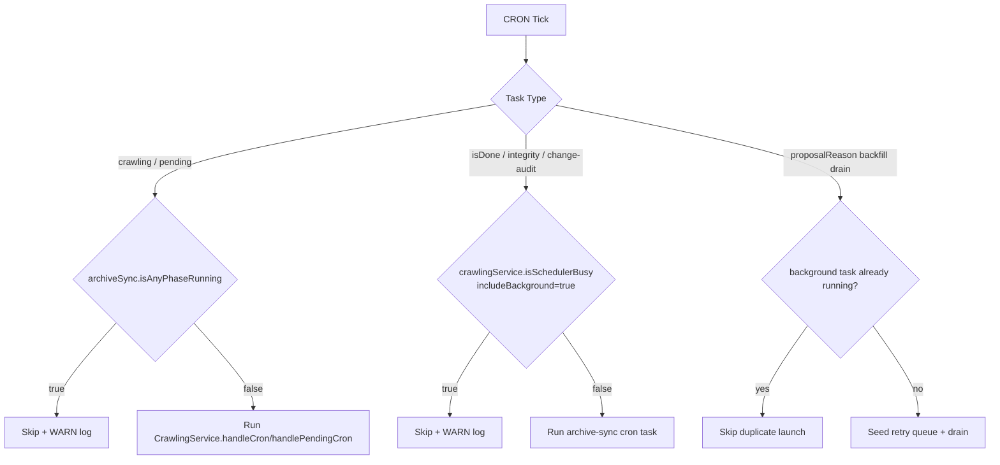
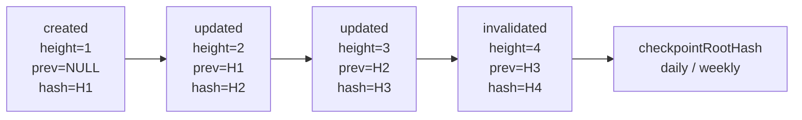
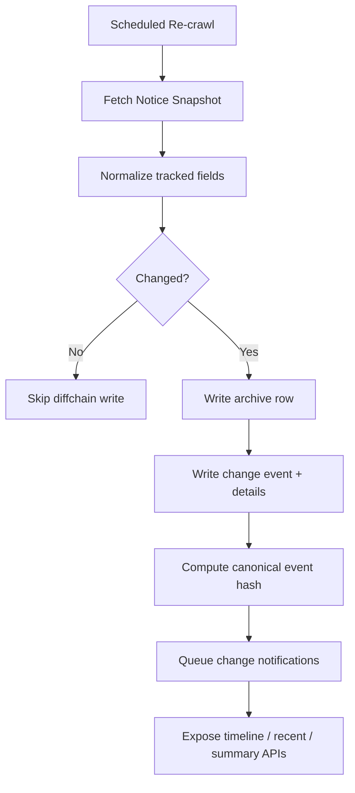

# LawCast Backend

NestJS 기반 API 서버입니다. 국회 입법예고(PAL)와 국민참여입법센터(NSM) 데이터를 수집/동기화하고, 아카이브 저장, 요약 생성, Discord 웹훅 알림, 운영용 디버그 브릿지를 제공합니다.

## 주요 기능

- PAL/NSM 크롤링 기반 입법예고 수집
- 아카이브 영속화(SQLite + TypeORM) 및 무결성(SHA-256) 검증
- NSM 선감지 → PAL 전환 시 동일 의안번호 기준 아카이브 갱신
- Redis 캐시 기반 최근 목록/검색 성능 최적화
- Ollama 연동 AI 요약(선택)
- Discord 웹훅 알림 전송
- Discord Debug Bridge(슬래시 커맨드 기반 운영 도구)

## 기술 스택

- Framework: NestJS 11
- Language: TypeScript
- DB: SQLite + TypeORM
- Cache: Redis (`@keyv/redis`, `@nestjs/cache-manager`)
- Crawler: `pal-crawl`
- Scheduler: `@nestjs/schedule`
- Notification: `discord-webhook-node`

## 설치 및 실행

### 요구사항

- Node.js
- npm
- Redis

### 설치

```bash
npm install
```

### 실행

```bash
# development
npm run start:dev

# debug (watch)
npm run start:debug

# production build
npm run build
npm run start:prod

# production (nest start)
npm run start
```

### 테스트

```bash
npm run test
npm run test:cov
npm run test:e2e
```

## 환경 변수

`.env` 예시:

```env
# Server
PORT=3001
NODE_ENV=development

# Database
DATABASE_PATH=lawcast.db

# Redis
REDIS_URL=redis://localhost:6379
REDIS_KEY_PREFIX=lawcast:
REDIS_TTL=1800

# HashGuard (webhook PoW)
HASHGUARD_API_URL=https://hashguard.viento.me
HASHGUARD_API_KEY=

# Ollama (optional)
OLLAMA_ENABLED=false
OLLAMA_API_URL=http://localhost:11434
OLLAMA_MODEL=gemma3:1b
OLLAMA_TIMEOUT=10000

# CORS origins (comma-separated)
FRONTEND_URL=http://localhost:5173

# Cron timezone
CRON_TIMEZONE=Asia/Seoul

# Discord Debug Bridge (optional)
DISCORD_BRIDGE_ENABLED=false
DISCORD_BRIDGE_BOT_TOKEN=
DISCORD_BRIDGE_GUILD_ID=
DISCORD_BRIDGE_CHANNEL_ID=
DISCORD_BRIDGE_LOG_CHANNEL_ID=
DISCORD_BRIDGE_LOG_LEVEL=LOG
DISCORD_BRIDGE_ADMIN_USER_IDS=
```

### Ollama 활성화 규칙

- `OLLAMA_ENABLED=true`: 항상 활성화 시도
- `OLLAMA_ENABLED=false`: 항상 비활성화
- `OLLAMA_ENABLED` 미설정: `OLLAMA_API_URL` + `OLLAMA_MODEL`이 모두 있을 때만 활성화

## 아카이브 동기화 파이프라인

서버 시작 시 백그라운드에서 아래 순서로 bootstrap 파이프라인이 실행됩니다.

1. Pending sync (NSM)
2. Legacy genesis seed (Diffchain baseline)
3. Full sync (PAL)
4. Summary backfill
5. Unavailable summary retry
6. isDone sync
7. Integrity check

추가로 정기 크론으로 보강 작업이 실행됩니다.

## 스케줄(기본값)

- `2-59/10 * * * *`: crawling check (PAL 중심 신규 감지/처리, 매시간 02/12/22/32/42/52분 실행)
- `6-59/20 * * * *`: pending crawling check (NSM 발의 단계, 매시간 06/26/46분 실행)
- `1 0 * * *`: webhook cleanup (매일 00:01 실행)
- `1 2 * * *`: webhook optimization (매일 02:01 실행)
- `0 * * * *`: system monitoring (매시 정각 실행)
- `13 */6 * * *`: isDone sync (6시간마다 13분에 실행: 00:13/06:13/12:13/18:13)
- `9-59/15 * * * *`: proposalReason backfill drain (매시간 09/24/39/54분 실행)
- `43 3 * * *`: integrity rescan (매일 03:43 실행)
- `7 4 * * *`: change-tracking daily audit (매일 04:07 실행)
- `19 4 * * 1`: change-tracking weekly audit (매주 월요일 04:19 실행)
- `11 * * * *`: quick keywords refresh (매시 11분 실행)
- `31 5 * * 0`: sqlite vacuum (매주 일요일 05:31 실행, DB 파일 공간 회수)

## 크론/페이즈 락

### 시작 시점(Trigger)과 진입 가드

- crawling/pending 크론은 `ArchiveSyncService.isAnyPhaseRunning()`이 `true`이면 스킵됩니다.
- archive-sync 계열 크론(isDone/integrity/change-tracking audit)은 `CrawlingService.isSchedulerBusy({ includeBackground: true })`가 `true`이면 스킵됩니다.
- sqlite vacuum 크론은 archive phase 실행 중이거나 crawling scheduler busy 상태이면 스킵됩니다.
- proposalReason backfill drain 크론은 crawling fast-path 락과 별개로 background task 중복 가드(`runBackgroundTask`)로 직렬화됩니다.

### 락 해제(Release) 지점

- archive phase 락: `ArchiveSyncPhaseRunner.runPhase()`의 `finally`에서 `tracker.isRunning=false`로 항상 해제됩니다.
- crawling fast-path 락: `CrawlingSchedulerService.handleCron()`의 `finally`에서 `isProcessing=false`로 해제됩니다.
- background task 락: `runBackgroundTask()`의 `finally`에서 task name이 `activeBackgroundTasks`에서 제거됩니다.

### 실행 제어 도식



## Project Diffchain: 변경 추적 및 감사 기능

Project Diffchain은 LawCast 아카이브의 변경 이력을 append-only 체인으로 저장하는 기능입니다. 재크롤링으로 얻은 현재 스냅샷과 기존 저장값을 비교해 필드 단위 diff를 만들고, 이를 `notice_change_events`와 `notice_change_details`에 기록합니다. 의안번호별로 `event_height`, `prev_event_hash`, `event_hash`를 유지해 체인 무결성을 검증할 수 있고, 상세 리비전 조회·변경 타임라인·최근 변경 목록·비교 가능 변경 요약·체인 감사·ZIP export가 모두 같은 데이터를 사용합니다.

### 기능 개요

- 재크롤링 시점마다 이전 스냅샷과 현재 스냅샷을 비교해 tracked fields만 diff로 저장합니다.
- 변경 이벤트 타입은 `created`, `updated`, `invalidated`입니다.
- `created` 이벤트는 초기 체인 생성용이며, `/api/notices/changes` 같은 최근 변경 목록에서는 제외됩니다.
- `invalidated` 이벤트는 `lifecycleStatus=source_deleted|renumbered|invalidated` 또는 `sourceDeletedAt` 존재 여부를 기준으로 생성됩니다.
- 각 이벤트는 의안번호별 단일 체인으로 연결되며, `prev_event_hash`와 `event_hash`로 무결성을 검증할 수 있습니다.
- 상세 페이지 리비전 조회는 체인 타임라인을 역방향으로 읽어 특정 `rev` 시점의 상태를 복원합니다.
- 일일/주간 체인 감사 작업은 전체 체인을 다시 재구성해 해시와 detail hash를 검증하고 `checkpointRootHash`를 계산합니다.

### 데이터 보장 방식

- 변경 이벤트는 UPDATE/DELETE 없이 append-only로 저장됩니다.
- 각 이벤트는 `event_height`를 가지며, 동일 의안번호 안에서 `1, 2, 3...` 순서로만 증가합니다.
- `notice_change_events`는 `notice_num + event_height`와 `event_hash`에 유니크 제약을 둬 중복 체인 생성을 막습니다.
- 이벤트 헤더에는 `source`, `changed_field_count`, `diff_summary_json`, `crawler_run_id`, `hash_algo`, `canon_version`이 함께 저장됩니다.
- 각 detail row에는 `before_value`, `after_value`, `before_hash`, `after_hash`가 저장됩니다.
- 이벤트 해시는 `ChangeTrackingService.buildDiffEvent()`에서 canonical JSON으로 계산하며, 필드 순서와 공백/날짜 포맷 차이를 정규화합니다.
- 감사 시에는 저장된 이벤트를 순서대로 다시 재구성해 `event_hash`, `prev_event_hash`, `event_height`, `changed_field_count`, `diffSummaryJson`, detail hash를 모두 대조합니다.

### 아카이브 라이프사이클 정책

- `lifecycle_status=active`: 소스에서 정상 확인 가능한 상태
- `lifecycle_status=source_deleted`: 코드상 `invalidated` 체인 이벤트로 표현됩니다.
- `lifecycle_status=renumbered`: 번호 변경(renumbering) 감지 시 기존 번호 체인 무효화(`invalidated`) 이벤트 표현에 사용됩니다.

번호 변경은 `noticeNum` 단일 키만으로 판단하지 않고 `contentId`/`contentBillNumber` 기반 동일성 후보를 우선 탐색합니다. immutable 정책 때문에 기존 아카이브 row 자체를 갱신하지 않고, 기존 번호 체인에는 `invalidated` 이벤트를 append하며 요약/상태 테이블을 새 번호로 재매핑합니다.

소스에서 사라진 법안 처리도 현재 구현에서는 별도 유지 테이블을 두지 않고 `invalidated` 이벤트와 체인 감사 결과로 추적합니다.

### 체인 구조 도식



체크포인트 블록(`checkpointRootHash`)은 단일 이벤트를 저장하는 별도 테이블이 아니라, 일/주간 감사 시점에 전체 체인 검증 결과를 요약해 계산한 SHA-256 값입니다. 구현상 `ChangeTrackingService.runScheduledChainAudit()`가 모든 의안 체인을 재검증한 뒤, 의안별 요약(`noticeNum`, `eventCount`, `latestEventHash`, `issueCount`)을 canonical JSON으로 직렬화해 `checkpointRootHash`를 만듭니다.

왜 필요한가:

- 전체 체인 상태를 한 값으로 고정해 같은 입력이면 같은 감사 결과가 재현됩니다.
- 운영 시점(일/주) 간에 감사 결과가 달라졌는지 빠르게 비교할 수 있습니다.
- 실패 건수와 함께 로그/Discord 브릿지로 남겨 사후 포렌식 시 "그 시점의 체인 상태"를 식별하는 기준점으로 사용됩니다.
- 개별 이벤트 검증(`prev_event_hash`, `event_hash`, detail hash)과 별개로, 전체 집합 무결성의 상위 요약 지문 역할을 합니다.

### 수집 및 변경 처리 흐름



### 감사 및 재검증 방식

1. 특정 의안번호의 이벤트를 `event_height` 오름차순으로 조회합니다.
2. 각 이벤트에 대해 canonical JSON을 재구성하고 `event_hash`를 재계산합니다.
3. `prev_event_hash` 연결성과 `event_height` 연속성을 검증합니다.
4. 각 detail row의 `before_hash`/`after_hash`를 다시 계산해 비교합니다.
5. 최종 결과를 의안별 요약으로 모아 `checkpointRootHash`를 계산합니다.

체크포인트 루트는 감사 결과 객체(`ChangeChainAuditReport`)에 포함되어 반환되며, `scope=daily|weekly`와 함께 운영 로그 및 Discord Debug Bridge에 기록됩니다. 감사 결과에는 `noticeCount`, `eventCount`, `failureCount`, `checkpointRootHash`, `failures`가 포함됩니다.

일일 감사는 최근 운영 상태를 빠르게 확인하기 위한 기본 검증이고, 주간 감사는 전체 체인을 다시 훑어 더 긴 시간 축의 무결성을 확인하는 용도입니다. 검증 실패가 발생하면 운영 채널과 Discord Debug Bridge에 요약이 남아 후속 대응이 가능해야 합니다.

### 저장 구조

- `notice_change_events`:
  `id`, `notice_num`, `detected_at`, `event_type`, `source`, `event_height`, `prev_event_hash`, `event_hash`, `changed_field_count`, `diff_summary_json`, `crawler_run_id`, `hash_algo`, `canon_version`.
- `notice_change_details`:
  `id`, `event_id`, `field_path`, `change_type`, `before_value`, `after_value`, `before_hash`, `after_hash`.

### 사용자 노출 지점

- `GET /api/notices/:num/changes`: 특정 의안번호의 최근 변경 타임라인을 제공합니다.
- `GET /api/notices/changes`: 전체 변경 이벤트 목록을 페이지네이션으로 제공합니다. 기본적으로 `created`는 제외되고, `eventType=updated|invalidated`만 필터로 허용됩니다.
- `GET /api/notices/changes/summary`: 비교 가능한 변경 이벤트 수를 `comparableEventTotal`과 `comparableNoticeCount`로 반환합니다.
- 상세 페이지 리비전 UI는 이벤트 해시, 변경 필드, before/after 값을 기반으로 변경 내역을 시각화합니다.
- 변경 알림은 신규 입법예고 알림과 분리되며, `created` 이벤트는 중복 알림을 피하기 위해 제외됩니다.
- `GET /api/notices/:num/export` 결과물에는 JSON 본문, 무결성 메타데이터, 검증 스크립트, 선택적 스크린샷, 그리고 `changeTrackingData`가 제공될 때 `.changes.json` 파일이 포함됩니다.

### 운영 기준

- DB 계정은 가능하면 change event 계열 테이블에 INSERT 중심 권한만 부여하는 것이 권장됩니다.
- 무결성 실패가 감지되면 해당 체인을 재수집/재검증 대상으로 격리하는 운영 절차가 필요합니다.
- 대량 변경이 발생하더라도 알림 전송은 배치 기반으로 처리해 시스템 부하를 제어합니다.
- 현재 기본 추적 범위는 사용자에게 의미 있는 핵심 메타데이터 중심이며, 필요 시 필드 확장이 가능합니다.

### 감사 가능성 보장 항목

- 동일 의안번호에 대해 특정 시점의 원문 해시를 재계산하여 DB 저장값과 비교 가능해야 합니다.
- 변경 이벤트 체인 해시를 첫 이벤트부터 순차 검증해 누락/변조를 탐지할 수 있어야 합니다.
- 알림 로그의 payload hash와 이벤트 hash를 연결해 "전송 사실"을 재현 가능해야 합니다.
- 운영자는 디버그 브릿지와 상태 페이지에서 "변경 감지 성공/실패/지연"을 추적할 수 있어야 합니다.

## API 엔드포인트

Base path: `/api`

| Method | Path                       | Description                                |
| ------ | -------------------------- | ------------------------------------------ |
| `POST` | `/webhooks`                | Discord 웹훅 등록 (PoW proof 필요)         |
| `GET`  | `/notices/recent`          | 최근 입법예고 목록                         |
| `GET`  | `/notices/keywords`        | 홈 빠른 검색용 추천 키워드                 |
| `GET`  | `/notices/archive`         | 아카이브 목록 조회(필터/정렬/페이지네이션) |
| `GET`  | `/notices/search`          | 통합 검색                                  |
| `GET`  | `/notices/:num/detail`     | 의안번호 상세(아카이브 기반)               |
| `GET`  | `/notices/:num/changes`    | 의안번호별 변경 이벤트 타임라인            |
| `GET`  | `/notices/changes`         | 전체 의안 변경 이벤트 목록(페이지네이션)   |
| `GET`  | `/notices/changes/summary` | 비교 가능한 변경 이벤트 요약               |
| `GET`  | `/notices/:num/screenshot` | 아카이브 스크린샷 이미지                   |
| `GET`  | `/notices/:num/export`     | 아카이브 ZIP 내보내기                      |
| `GET`  | `/stats`                   | 런타임 통계(아카이브/요약/캐시 포함)       |
| `GET`  | `/batch/status`            | 배치 상태                                  |
| `GET`  | `/health`                  | 헬스 상태                                  |
| `GET`  | `/webhooks/stats/detailed` | 웹훅 상세 통계                             |
| `GET`  | `/webhooks/system-health`  | 웹훅 시스템 헬스                           |
| `GET`  | `/redis/status`            | Redis 상세 상태                            |
| `GET`  | `/redis/connection`        | Redis 연결 여부                            |
| `GET`  | `/packages`                | 패키지 버전 정보                           |

### 주요 쿼리 파라미터

`GET /api/notices/keywords`

- `limit` (default: `8`, 최대 응답 개수)

`GET /api/notices/archive`

- `page` (default: `1`)
- `limit` (default: `10`, max: `50`)
- `search`
- `startDate`, `endDate`
- `sortOrder` (`asc` or `desc`, default: `desc`)
- `isDone` (`true`/`false`)
- `fullText` (`true`일 때 원문 텍스트 검색 포함)

`GET /api/notices/search`

- `q` (검색어)
- `page` (default: `1`)
- `limit` (default: `10`, max: `50`)
- `includeDone` (default: `true`)

`GET /api/notices/:num/detail`

- `rev` (선택, `1` 이상의 정수. 특정 변경 리비전 시점으로 상세 복원)

`GET /api/notices/:num/changes`

- `limit` (default: `20`)

`GET /api/notices/changes`

- `page` (default: `1`)
- `limit` (default: `20`)
- `eventType` (`updated` | `invalidated`)
- `excludeLegacyGenesisSource` (`true`일 때 legacy bootstrap seed 이벤트 제외)
- `comparableOnly` (`true`일 때 비교 가능한 변경 이벤트만 조회)

## 아카이브 Export ZIP 구성

`GET /api/notices/:num/export`는 다음 아티팩트를 ZIP으로 제공합니다.

- `<base>.json`: DB raw record + integrity snapshot + HTTP metadata
- `<base>.changes.json`: 변경 이벤트 타임라인 + 필드 diff 스냅샷
- `<base>.integrity.txt`: 무결성 메타데이터 텍스트
- `verify-integrity.sh`: Bash 검증 스크립트
- `verify-integrity.ps1`: PowerShell 검증 스크립트
- `screenshot.<format>`: 스크린샷이 존재할 때만 포함

`<base>`는 `lawcast-archive-<noticeNum>-<timestamp>` 형식입니다.

## Discord Debug Bridge

`DISCORD_BRIDGE_ENABLED=true`일 때 Discord 봇이 슬래시 커맨드를 등록합니다.

지원 명령:

- `/status`
- `/health`
- `/stats`
- `/cache`
- `/crawl`
- `/batch-history`
- `/webhooks`
- `/loglevel` (조회/변경)
- `/locks` (scheduler/phase lock 상태 + 크론 레이아웃 디버깅)

`DISCORD_BRIDGE_GUILD_ID`가 설정되면 guild 명령으로 즉시 등록되고, 미설정 시 global 명령으로 등록됩니다(전파 지연 가능).

## 프로젝트 구조

```text
src/
├── app.module.ts
├── main.ts
├── config/
├── controllers/
├── e2e/
├── migrations/
├── modules/
│   ├── cache/
│   ├── crawling/
│   ├── discord-bridge/
│   ├── health/
│   ├── notice/
│   ├── notification/
│   ├── ollama/
│   ├── scheduling/
│   ├── shared/
│   └── webhook/
├── types/
└── utils/
```

## 라이선스

MIT
