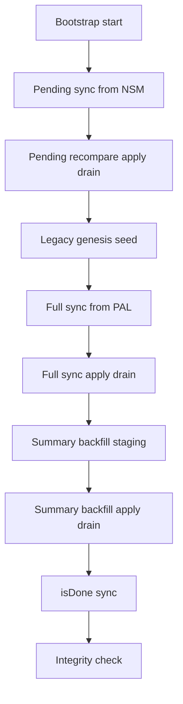
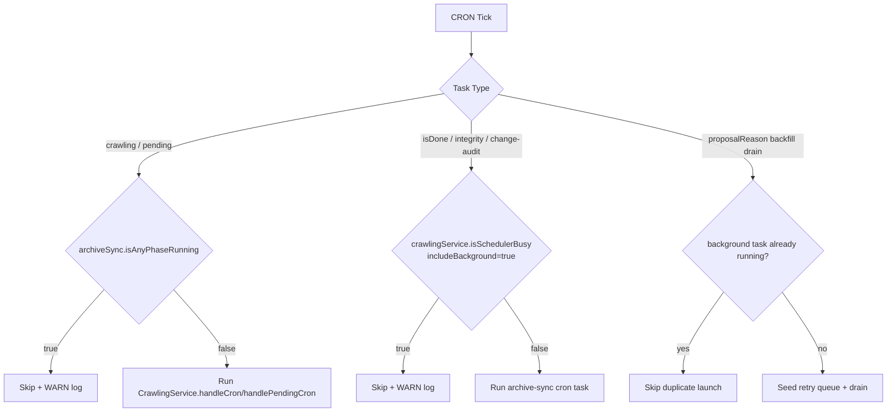
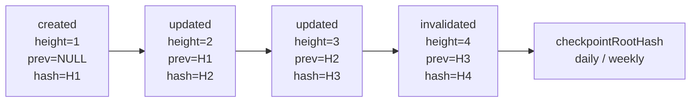
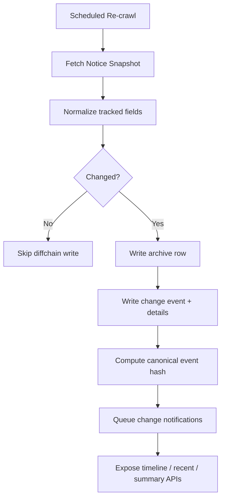

# LawCast Backend

NestJS 기반 API 서버입니다. 국회 입법예고(PAL)와 국민참여입법센터(NSM) 데이터를 수집/동기화하고, 아카이브 저장, 요약 생성, Discord 웹훅 알림, 운영용 디버그 브릿지를 제공합니다.

## 주요 기능

- PAL/NSM 크롤링 기반 입법예고 수집
- 아카이브 영속화(SQLite + TypeORM) 및 무결성(SHA-256) 검증
- NSM 선감지 → PAL 전환 시 동일 의안번호 기준 아카이브 갱신
- Redis 캐시 기반 최근 목록/검색 성능 최적화
- Ollama 연동 AI 요약(선택)
- Discord 웹훅 알림 전송
- 브라우저 Web Push 알림 전송(VAPID)
- Discord Debug Bridge(슬래시 커맨드 기반 운영 도구)

## 기술 스택

- Framework: NestJS 11
- Language: TypeScript
- DB: SQLite + TypeORM
- Cache: Redis (`@keyv/redis`, `@nestjs/cache-manager`)
- Crawler: `pal-crawl`
- Scheduler: `@nestjs/schedule`
- Notification: `discord-webhook-node`, `web-push`

## 설치 및 실행

### 요구사항

- Node.js
- npm
- Redis

### 설치

```bash
npm install
```

### 실행

```bash
# development
npm run start:dev

# debug (watch)
npm run start:debug

# production build
npm run build
npm run start:prod

# production (nest start)
npm run start
```

### 테스트

```bash
npm run test
npm run test:cov
npm run test:e2e
```

## 환경 변수

`.env` 예시:

```env
# Server
PORT=3001
NODE_ENV=development

# Database
DATABASE_PATH=lawcast.db

# Redis
REDIS_URL=redis://localhost:6379
REDIS_KEY_PREFIX=lawcast:
REDIS_TTL=1800

# HashGuard (webhook PoW)
HASHGUARD_API_URL=https://hashguard.viento.me
HASHGUARD_API_KEY=

# Web Push (optional)
WEB_PUSH_ENABLED=false
WEB_PUSH_VAPID_PUBLIC_KEY=
WEB_PUSH_VAPID_PRIVATE_KEY=
WEB_PUSH_SUBJECT=mailto:lawcast@example.com

# Ollama (optional)
OLLAMA_ENABLED=false
OLLAMA_CPU_MODE=false
OLLAMA_API_URL=http://localhost:11434
OLLAMA_MODEL=gemma3:1b
OLLAMA_TIMEOUT=10000

# Archive sync tuning
ARCHIVE_SYNC_CRAWLER_CONCURRENCY=4
ARCHIVE_SYNC_NSM_CRAWLER_CONCURRENCY=3
ARCHIVE_SYNC_DONE_CRAWLER_CONCURRENCY=3
ARCHIVE_SYNC_FULL_SYNC_APPLY_BATCH_SIZE=100
ARCHIVE_SYNC_FULL_SYNC_APPLY_BATCH_DELAY_MS=100
ARCHIVE_SYNC_PENDING_RECOMPARE_APPLY_BATCH_SIZE=100
ARCHIVE_SYNC_PENDING_RECOMPARE_APPLY_BATCH_DELAY_MS=150
ARCHIVE_SYNC_ASYNC_APPLY_QUEUE_TTL_SECONDS=604800
ARCHIVE_SYNC_SUMMARY_BACKFILL_CPU_BATCH_SIZE=5
ARCHIVE_SYNC_SUMMARY_BACKFILL_CPU_BATCH_DELAY_MS=250
ARCHIVE_SYNC_SUMMARY_BACKFILL_CPU_CONCURRENCY=1

# CORS origins (comma-separated)
FRONTEND_URL=http://localhost:5173

# Cron timezone
CRON_TIMEZONE=Asia/Seoul

# Database mirror to file.kiwi (optional)
FILE_MIRROR_ENABLED=false
FILE_MIRROR_CRON=47 6 * * *
FILE_MIRROR_API_BASE_URL=https://api.file.kiwi
FILE_MIRROR_DUMP_DIR=./tmp/db-mirror
FILE_MIRROR_TITLE_PREFIX=lawcast-db-mirror
FILE_MIRROR_KEEP_LOCAL_DUMP=false
FILE_MIRROR_TEST_UPLOAD_ON_STARTUP=false
FILE_MIRROR_DISCORD_CHANNEL_ID=

# Discord Debug Bridge (optional)
DISCORD_BRIDGE_ENABLED=false
DISCORD_BRIDGE_BOT_TOKEN=
DISCORD_BRIDGE_GUILD_ID=
DISCORD_BRIDGE_CHANNEL_ID=
DISCORD_BRIDGE_LOG_CHANNEL_ID=
DISCORD_BRIDGE_LOG_LEVEL=LOG
DISCORD_BRIDGE_ADMIN_USER_IDS=
```

### Ollama 활성화 규칙

- `OLLAMA_ENABLED=true`: 항상 활성화 시도
- `OLLAMA_ENABLED=false`: 항상 비활성화
- `OLLAMA_ENABLED` 미설정: `OLLAMA_API_URL` + `OLLAMA_MODEL`이 모두 있을 때만 활성화

### Ollama CPU 모드

`OLLAMA_CPU_MODE=true`로 설정하면 summary backfill이 CPU 친화 모드로 동작합니다.

- summary backfill 스캔 배치 크기를 일반 모드 기본값(20) 대신 `ARCHIVE_SYNC_SUMMARY_BACKFILL_CPU_BATCH_SIZE`로 낮춥니다.
- 요약 생성 동시성을 `ARCHIVE_SYNC_SUMMARY_BACKFILL_CPU_CONCURRENCY`로 강제 제한합니다.
- apply worker가 각 요약 배치를 처리한 뒤 `ARCHIVE_SYNC_SUMMARY_BACKFILL_CPU_BATCH_DELAY_MS`만큼 쉬면서 CPU 스파이크를 완화합니다.
- 부트스트랩 중 summary backfill은 먼저 대상 notice를 큐에 staging한 뒤 apply worker가 순차 처리하므로, offset 기반 스캔 중간에 큐를 비워서 후보를 건너뛰는 문제가 생기지 않도록 설계되어 있습니다.

권장값 예시:

```env
OLLAMA_ENABLED=true
OLLAMA_CPU_MODE=true
OLLAMA_API_URL=http://localhost:11434
OLLAMA_MODEL=gemma3:1b
OLLAMA_TIMEOUT=30000
ARCHIVE_SYNC_SUMMARY_BACKFILL_CPU_BATCH_SIZE=5
ARCHIVE_SYNC_SUMMARY_BACKFILL_CPU_BATCH_DELAY_MS=250
ARCHIVE_SYNC_SUMMARY_BACKFILL_CPU_CONCURRENCY=1
```

### Web Push 활성화 규칙

- `WEB_PUSH_ENABLED=true` 이고, `WEB_PUSH_VAPID_PUBLIC_KEY` + `WEB_PUSH_VAPID_PRIVATE_KEY`가 모두 설정된 경우에만 활성화됩니다.
- 위 조건이 충족되지 않으면 서버는 Web Push를 비활성으로 간주하고 공개키 API는 `enabled=false`를 반환합니다.

### Web Push 설정 가이드

1. VAPID 키 생성

```bash
npx web-push generate-vapid-keys
```

2. 생성된 키를 `.env`에 설정

```env
WEB_PUSH_ENABLED=true
WEB_PUSH_VAPID_PUBLIC_KEY=...
WEB_PUSH_VAPID_PRIVATE_KEY=...
WEB_PUSH_SUBJECT=mailto:lawcast@example.com
```

3. 프론트엔드에서 브라우저 알림 권한을 허용하고 구독을 등록하면, 백엔드가 `web_push_subscriptions` 테이블에 endpoint/key를 저장합니다.

4. 신규 입법예고/변경 감지 배치가 실행될 때 Discord 웹훅과 함께 Web Push도 병렬 전송됩니다.

주의사항:

- 개발/운영 도메인이 다르면 각 도메인별로 브라우저 구독이 따로 생성됩니다.
- 브라우저가 반환한 구독 endpoint가 만료(예: 404/410)되면 백엔드에서 해당 구독을 자동 비활성화합니다.

## 아카이브 동기화 파이프라인

LawCast의 법률안 전체 동기화는 단일 대량 트랜잭션이 아니라, 단계별 phase와 비동기 apply worker를 조합한 파이프라인으로 동작합니다. 목적은 다음 세 가지입니다.

- NSM에서 먼저 보이는 발의안과 PAL 본문 수집을 같은 번호 기준으로 점진적으로 합치기
- 무거운 DB 쓰기와 요약 생성을 큐 기반 background apply로 분리해 크롤링 phase의 실패 범위를 줄이기
- 부트스트랩과 정기 크론이 서로 충돌하지 않도록 phase lock과 queue drain을 분리하기

### 부트스트랩 전체 동기화 순서

서버 시작 시 백그라운드에서 아래 순서로 bootstrap 파이프라인이 실행됩니다.

1. Pending sync (NSM)
2. Pending recompare async apply drain
3. Legacy genesis seed (Diffchain baseline)
4. Full sync (PAL)
5. Full sync async apply drain
6. Summary backfill
7. Summary backfill async apply drain
8. isDone sync
9. Integrity check

설명:

- Pending sync는 NSM의 발의 단계 목록을 수집해 새 의안을 우선 아카이브하고, 이미 존재하는 NSM 의안 중 PAL 본문이 아직 없는 항목은 pending recompare 큐로 보냅니다.
- Legacy genesis seed는 기존 아카이브를 diffchain 기준선으로 시드합니다.
- Full sync는 PAL 전체 페이지를 순회하며 새 notice를 수집하고, 실제 아카이브 저장은 full sync apply queue를 통해 배치 처리합니다.
- Summary backfill은 `not_requested`, recovery 대상, `unavailable` 재시도 대상을 한 phase에서 함께 스캔해 summary backfill queue로 적재합니다.
- `Unavailable summary retry`는 별도 phase가 아니라 현재는 summary backfill phase 내부에 통합되어 있습니다.
- 각 async apply drain은 해당 phase에 필요한 worker만 기다립니다. 예를 들어 summary drain이 pending/full queue까지 같이 기다리지는 않습니다.

### 비동기 apply worker 구조

아카이브 동기화는 다음 세 개의 Redis 기반 queue를 사용합니다.

- full sync apply queue: PAL full sync가 적재한 notice를 배치 저장
- pending recompare apply queue: NSM 선감지 후 PAL 본문이 비어 있는 기존 notice 재비교
- summary backfill apply queue: Ollama 요약 생성 및 상태 저장

이 구조 덕분에 크롤링/스캔 phase는 빠르게 끝내고, 저장/요약 같은 무거운 작업은 별도 drain으로 안정적으로 재시도할 수 있습니다.

### 백필과 snapshot artifact 복구 규칙

아카이브는 한 번 저장된 snapshot row를 "완전 불변"으로 유지하면서도, 초기 캡처가 실패했더라도 이후 재시도에서 NULL 상태인 artifact만 채우는 복구 경로를 제공합니다.

- `source_html`, `source_html_sha256`, `http_metadata_json`, `http_fetched_at`, `http_status_code`, `http_content_type`, `http_etag`, `http_last_modified`, `screenshot_blob`, `screenshot_format` 등 snapshot artifact는 기존 값이 있으면 절대 덮어쓰지 않습니다.
- 각 컬럼이 `NULL`일 때만 `WHERE ... IS NULL` 조건으로 갱신을 시도합니다. 이미 값이 채워진 경우는 no-op입니다.
- 이 규칙은 DB 레벨 trigger에도 반영되어 있어, 초기 첫 채움만 허용하고 이후 비NULL→다른 값 갱신을 막습니다.
- source HTML이 채워지면 무결성 상태를 `pending_recheck`로 복구해, 새로 채운 artifact를 다시 검증 대상으로 돌립니다.
- source snapshot이 없거나 검증 불가 상태인 notice를 별도 deficit로 남겨, 백필/재검증 queue에서 안전하게 재처리하도록 합니다.

즉, "아예 스냅샷이 없던 row를 조용히 누락 상태로 둔 채 진행하는 것"과 "NULL인 artifact만 한 번 채우는 정당한 first-fill"을 구분합니다. 이는 proposalReason backfill, 재크롤링, integrity rescan이 모두 동일한 규칙 아래에서 동작하게 해줍니다.

### 백필이 만드는 재시도 대상과 정합성

다음 경로는 모두 핵심 데이터가 비어 있는 notice를 재시도 대상으로 유지합니다.

- `proposalReason backfill drain`: NSM 상세 페이지가 비어 있거나 삭제 신호를 받은 건을 다시 확인해 `proposalReason`와 관련 상태를 보완합니다.
- `summary backfill`: `not_requested`, recovery 대상, `unavailable` 상태의 summary를 함께 큐에 적재해 배치 생성/적용을 수행합니다.
- integrity deficit seeding: source snapshot 또는 SHA-256가 비어 있으면 row를 시드하고, 이후 backfill/recheck 작업이 다시 채우도록 합니다.

핵심은 "누락 상태를 감춰 버리지 않고 추적 가능한 retry target으로 남긴다"는 점입니다. 이렇게 해야 이전에는 전체 row가 저장돼도 어떤 artifact만 사라진 상태가 생기는 구멍이 운영 중에 조용히 남지 않습니다.

### 전체 동기화 흐름 요급


```mermaid
flowchart TD
	A[Bootstrap start] --> B[Pending sync from NSM]
	B --> C[Pending recompare apply drain]
	C --> D[Legacy genesis seed]
	D --> E[Full sync from PAL]
	E --> F[Full sync apply drain]
	F --> G[Summary backfill staging]
	G --> H[Summary backfill apply drain]
	H --> I[isDone sync]
	I --> J[Integrity check]
```

### 운영 튜닝 포인트

- 크롤링 HTTP 병렬도: `ARCHIVE_SYNC_CRAWLER_CONCURRENCY`, `ARCHIVE_SYNC_NSM_CRAWLER_CONCURRENCY`, `ARCHIVE_SYNC_DONE_CRAWLER_CONCURRENCY`
- background apply 배치: `ARCHIVE_SYNC_FULL_SYNC_APPLY_BATCH_SIZE`, `ARCHIVE_SYNC_PENDING_RECOMPARE_APPLY_BATCH_SIZE`
- background apply 간격: `ARCHIVE_SYNC_FULL_SYNC_APPLY_BATCH_DELAY_MS`, `ARCHIVE_SYNC_PENDING_RECOMPARE_APPLY_BATCH_DELAY_MS`
- Redis queue 유지 기간: `ARCHIVE_SYNC_ASYNC_APPLY_QUEUE_TTL_SECONDS`
- CPU 기반 요약 제어: `OLLAMA_CPU_MODE`, `ARCHIVE_SYNC_SUMMARY_BACKFILL_CPU_BATCH_SIZE`, `ARCHIVE_SYNC_SUMMARY_BACKFILL_CPU_BATCH_DELAY_MS`, `ARCHIVE_SYNC_SUMMARY_BACKFILL_CPU_CONCURRENCY`

추가로 정기 크론으로 보강 작업이 실행됩니다.

## 스케줄(기본값)

- `2-59/10 * * * *`: crawling check (PAL 중심 신규 감지/처리, 매시간 02/12/22/32/42/52분 실행)
- `6-59/20 * * * *`: pending crawling check (NSM 발의 단계, 매시간 06/26/46분 실행)
- `1 0 * * *`: webhook cleanup (매일 00:01 실행)
- `1 2 * * *`: webhook optimization (매일 02:01 실행)
- `0 * * * *`: system monitoring (매시 정각 실행)
- `13 */6 * * *`: isDone sync (6시간마다 13분에 실행: 00:13/06:13/12:13/18:13)
- `9-59/15 * * * *`: proposalReason backfill drain (매시간 09/24/39/54분 실행)
- `43 3 * * *`: integrity rescan (매일 03:43 실행)
- `7 4 * * *`: change-tracking daily audit (매일 04:07 실행)
- `19 4 * * 1`: change-tracking weekly audit (매주 월요일 04:19 실행)
- `11 * * * *`: quick keywords refresh (매시 11분 실행)
- `31 5 * * 0`: sqlite vacuum (매주 일요일 05:31 실행, DB 파일 공간 회수)
- `47 6 * * *`: database mirror upload (매일 06:47 실행, 민감 테이블 제외 dump를 file.kiwi API로 업로드)

## 크론/페이즈 락

### 시작 시점(Trigger)과 진입 가드

- crawling/pending 크론은 `ArchiveSyncService.isAnyPhaseRunning()`이 `true`이면 스킵됩니다.
- archive-sync 계열 크론(isDone/integrity/change-tracking audit)은 `CrawlingService.isSchedulerBusy({ includeBackground: true })`가 `true`이면 스킵됩니다.
- sqlite vacuum 크론은 archive phase 실행 중이거나 crawling scheduler busy 상태이면 스킵됩니다.
- proposalReason backfill drain 크론은 crawling fast-path 락과 별개로 background task 중복 가드(`runBackgroundTask`)로 직렬화됩니다.

### 락 해제(Release) 지점

- archive phase 락: `ArchiveSyncPhaseRunner.runPhase()`의 `finally`에서 `tracker.isRunning=false`로 항상 해제됩니다.
- crawling fast-path 락: `CrawlingSchedulerService.handleCron()`의 `finally`에서 `isProcessing=false`로 해제됩니다.
- background task 락: `runBackgroundTask()`의 `finally`에서 task name이 `activeBackgroundTasks`에서 제거됩니다.

### 실행 제어 도식


```mermaid
flowchart TD
		A[CRON Tick] --> B{Task Type}

		B -->|crawling / pending| C{archiveSync.isAnyPhaseRunning}
		C -->|true| C1[Skip + WARN log]
		C -->|false| C2[Run CrawlingService.handleCron/handlePendingCron]

		B -->|isDone / integrity / change-audit| D{crawlingService.isSchedulerBusy\nincludeBackground=true}
		D -->|true| D1[Skip + WARN log]
		D -->|false| D2[Run archive-sync cron task]

		B -->|proposalReason backfill drain| E{background task already running?}
		E -->|yes| E1[Skip duplicate launch]
		E -->|no| E2[Seed retry queue + drain]
```

## Project Diffchain: 변경 추적 및 감사 기능

Project Diffchain은 LawCast 아카이브의 변경 이력을 append-only 체인으로 저장하는 기능입니다. 재크롤링으로 얻은 현재 스냅샷과 기존 저장값을 비교해 필드 단위 diff를 만들고, 이를 `notice_change_events`와 `notice_change_details`에 기록합니다. 의안번호별로 `event_height`, `prev_event_hash`, `event_hash`를 유지해 체인 무결성을 검증할 수 있고, 상세 리비전 조회·변경 타임라인·최근 변경 목록·비교 가능 변경 요약·체인 감사·ZIP export가 모두 같은 데이터를 사용합니다.

### 기능 개요

- 재크롤링 시점마다 이전 스냅샷과 현재 스냅샷을 비교해 tracked fields만 diff로 저장합니다.
- 변경 이벤트 타입은 `created`, `updated`, `invalidated`입니다.
- `created` 이벤트는 초기 체인 생성용이며, `/api/notices/changes` 같은 최근 변경 목록에서는 제외됩니다.
- `invalidated` 이벤트는 `lifecycleStatus=source_deleted|renumbered|invalidated` 또는 `sourceDeletedAt` 존재 여부를 기준으로 생성됩니다.
- 각 이벤트는 의안번호별 단일 체인으로 연결되며, `prev_event_hash`와 `event_hash`로 무결성을 검증할 수 있습니다.
- 상세 페이지 리비전 조회는 체인 타임라인을 역방향으로 읽어 특정 `rev` 시점의 상태를 복원합니다.
- 일일/주간 체인 감사 작업은 전체 체인을 다시 재구성해 해시와 detail hash를 검증하고 `checkpointRootHash`를 계산합니다.

### 데이터 보장 방식

- 변경 이벤트는 UPDATE/DELETE 없이 append-only로 저장됩니다.
- 각 이벤트는 `event_height`를 가지며, 동일 의안번호 안에서 `1, 2, 3...` 순서로만 증가합니다.
- `notice_change_events`는 `notice_num + event_height`와 `event_hash`에 유니크 제약을 둬 중복 체인 생성을 막습니다.
- 이벤트 헤더에는 `source`, `changed_field_count`, `diff_summary_json`, `crawler_run_id`, `hash_algo`, `canon_version`이 함께 저장됩니다.
- 각 detail row에는 `before_value`, `after_value`, `before_hash`, `after_hash`가 저장됩니다.
- 이벤트 해시는 `ChangeTrackingService.buildDiffEvent()`에서 canonical JSON으로 계산하며, 필드 순서와 공백/날짜 포맷 차이를 정규화합니다.
- 감사 시에는 저장된 이벤트를 순서대로 다시 재구성해 `event_hash`, `prev_event_hash`, `event_height`, `changed_field_count`, `diffSummaryJson`, detail hash를 모두 대조합니다.

### 아카이브 라이프사이클 정책

- `lifecycle_status=active`: 소스에서 정상 확인 가능한 상태
- `lifecycle_status=source_deleted`: 코드상 `invalidated` 체인 이벤트로 표현됩니다.
- `lifecycle_status=renumbered`: 번호 변경(renumbering) 감지 시 기존 번호 체인 무효화(`invalidated`) 이벤트 표현에 사용됩니다.

번호 변경은 `noticeNum` 단일 키만으로 판단하지 않고 `contentId`/`contentBillNumber` 기반 동일성 후보를 우선 탐색합니다. immutable 정책 때문에 기존 아카이브 row 자체를 갱신하지 않고, 기존 번호 체인에는 `invalidated` 이벤트를 append하며 요약/상태 테이블을 새 번호로 재매핑합니다.

소스에서 사라진 법안 처리도 현재 구현에서는 별도 유지 테이블을 두지 않고 `invalidated` 이벤트와 체인 감사 결과로 추적합니다.

### 체인 구조 도식


```mermaid
flowchart LR
	E1[created\nheight=1\nprev=NULL\nhash=H1] --> E2[updated\nheight=2\nprev=H1\nhash=H2]
	E2 --> E3[updated\nheight=3\nprev=H2\nhash=H3]
	E3 --> E4[invalidated\nheight=4\nprev=H3\nhash=H4]
	E4 --> CP[checkpointRootHash\ndaily / weekly]
```

체크포인트 블록(`checkpointRootHash`)은 단일 이벤트를 저장하는 별도 테이블이 아니라, 일/주간 감사 시점에 전체 체인 검증 결과를 요약해 계산한 SHA-256 값입니다. 구현상 `ChangeTrackingService.runScheduledChainAudit()`가 모든 의안 체인을 재검증한 뒤, 의안별 요약(`noticeNum`, `eventCount`, `latestEventHash`, `issueCount`)을 canonical JSON으로 직렬화해 `checkpointRootHash`를 만듭니다.

왜 필요한가:

- 전체 체인 상태를 한 값으로 고정해 같은 입력이면 같은 감사 결과가 재현됩니다.
- 운영 시점(일/주) 간에 감사 결과가 달라졌는지 빠르게 비교할 수 있습니다.
- 실패 건수와 함께 로그/Discord 브릿지로 남겨 사후 포렌식 시 "그 시점의 체인 상태"를 식별하는 기준점으로 사용됩니다.
- 개별 이벤트 검증(`prev_event_hash`, `event_hash`, detail hash)과 별개로, 전체 집합 무결성의 상위 요약 지문 역할을 합니다.

### 수집 및 변경 처리 흐름


```mermaid
flowchart TD
	A[Scheduled Re-crawl] --> B[Fetch Notice Snapshot]
	B --> C[Normalize tracked fields]
	C --> D{Changed?}
	D -->|No| E[Skip diffchain write]
	D -->|Yes| F[Write archive row]
	F --> G[Write change event + details]
	G --> H[Compute canonical event hash]
	H --> I[Queue change notifications]
	I --> J[Expose timeline / recent / summary APIs]
```

### 감사 및 재검증 방식

1. 특정 의안번호의 이벤트를 `event_height` 오름차순으로 조회합니다.
2. 각 이벤트에 대해 canonical JSON을 재구성하고 `event_hash`를 재계산합니다.
3. `prev_event_hash` 연결성과 `event_height` 연속성을 검증합니다.
4. 각 detail row의 `before_hash`/`after_hash`를 다시 계산해 비교합니다.
5. 최종 결과를 의안별 요약으로 모아 `checkpointRootHash`를 계산합니다.

체크포인트 루트는 감사 결과 객체(`ChangeChainAuditReport`)에 포함되어 반환되며, `scope=daily|weekly`와 함께 운영 로그 및 Discord Debug Bridge에 기록됩니다. 감사 결과에는 `noticeCount`, `eventCount`, `failureCount`, `checkpointRootHash`, `failures`가 포함됩니다.

일일 감사는 최근 운영 상태를 빠르게 확인하기 위한 기본 검증이고, 주간 감사는 전체 체인을 다시 훑어 더 긴 시간 축의 무결성을 확인하는 용도입니다. 검증 실패가 발생하면 운영 채널과 Discord Debug Bridge에 요약이 남아 후속 대응이 가능해야 합니다.

### 규칙 버전 관리(canonVersion)와 과거 이벤트 처리

diffchain은 비교/해시 규칙이 바뀌어도 **과거에 저장된 이벤트를 현재 규칙으로 재해석하지 않도록** 이벤트별로 규칙 버전(`canon_version`)을 함께 저장합니다. 감사는 이벤트마다 자기 버전의 규칙으로만 재구성하므로, 과거 규칙으로 생성된 이벤트가 "현재 규칙 위반"으로 잘못 잡히지 않습니다.

#### 버전별 규칙

| 규칙 | v1 (레거시) | v2 (현행) |
| --- | --- | --- |
| tracked fields | `LEGACY_TRACKED_FIELDS_V1` (contentId 미포함) | `DEFAULT_TRACKED_FIELDS` (contentId 포함) |
| `proposalReason` 비교 | 줄바꿈 보존 리터럴 비교 | semantic 비교 (공백·줄 배치·빈 줄 수 무시, Unicode/NBSP/zero-width 공백 정규화) |
| archive:upsert snapshot canonicalization | 없음 (raw 스냅샷 그대로 해시) | subject의 `(N의원 등 M인)` 접미사 제거, `proposalDate` → ISO, `proposalSession` → `제N회` |

감사 재구성 시 tracked fields 선택은 `getTrackedFieldsForChangeEvent()`가, snapshot canonicalization 적용 여부는 `canonicalizeChangeSnapshotForSource()`가 담당하며, 둘 다 이벤트의 `source` + `canonVersion` 기준으로 분기합니다.

#### 혼합 체인(v1→v2) 처리

하나의 의안번호 체인 안에 v1 이벤트와 v2 이벤트가 섞여 있어도, 감사는 **이벤트 단위로** 해당 버전의 규칙을 적용해 상태를 재구성합니다. v1 구간은 raw 스냅샷 해시와 일치하고, v2 구간은 canonicalization이 적용된 해시와 일치하므로 전환이 체인 무결성을 깨지 않습니다.

#### pre-versioned contentId 체인 (버전 컬럼 도입 전) 처리

contentId 추적이 활성화됐지만 `canon_version` 컬럼이 아직 없던 시기에 생성된 v1 이벤트는 `contentId` detail을 갖고 있습니다. 이 이벤트들은 `DEFAULT_TRACKED_FIELDS`로 diff되었지만 **snapshot canonicalization 없이 raw 스냅샷으로 해시**되었으므로, 감사는 다음 두 가지만 적용합니다.

- 상태 복원: `DEFAULT_TRACKED_FIELDS` (contentId 포함) → 저장된 detail과 일치
- snapshot canonicalization: **미적용** (해시가 raw 스냅샷 기준이므로 v2용 정규화를 씌우면 해시가 깨짐)

감지는 체인 내 v1 `archive:upsert` 이벤트에 `contentId` detail이 존재하는지로 판단하며, `change-tracking-chain-audit.utils.ts`의 `hasPreVersionedArchiveUpsert`가 담당합니다.

운영 DB(`lawcast_prod.db`) 기준 실제 검증 수치:

- v1 이벤트 48,762개 중 339개가 pre-versioned contentId detail 보유
- 이 처리를 비활성화하면 **1,017건의 감사 실패** 발생 (`event_hash_mismatch` 339 + `changed_field_count_mismatch` 339 + `diff_summary_mismatch` 339)
- 처리를 적용하면 전체 **48,762개 이벤트 / 20,084개 체인 모두 0 failures**

#### 레거시 hash drift 허용 (v1 전용)

v1 이벤트는 재구성한 `event_hash`가 저장값과 달라도 아래 조건이 **모두** 일치하면 정식 호환(legacy-compatible)으로 간주해 허용합니다.

- `event_type`, `changed_field_count`, `diff_summary_json` 일치
- detail rows 개수와 각 detail의 `field_path`/`change_type`/`before_value`/`after_value`/`before_hash`/`after_hash` 일치

`prev_event_hash` drift(과거 규칙으로 연결된 해시)도 동일 기준으로 허용되며, 이후 이벤트는 저장된 해시를 기준으로 체인을 이어갑니다. v2 이상 이벤트는 이 완화를 적용하지 않고 hash 불일치 시 즉시 실패로 처리합니다.

이 완화는 "과거 체인을 현재 정책으로 재해석"하는 것이 아니라, "과거 규칙이 만든 저장값 자체가 자기 내부적으로 일관적인지"만 확인하는 방어 장치입니다. 저장된 값이 변조되면 detail 값/해시 대조에서 걸러집니다.

#### 수동 검증 (읽기 전용)

일/주간 감사는 크론(`7 4 * * *`, `19 4 * * 1`)으로 실행되지만, 운영 DB에 대해 읽기 전용으로 수동 검증할 수도 있습니다.

```bash
# backend 디렉터리에서, 운영 DB는 프로젝트 루트의 lawcast_prod.db
npm run build
node -e "
const sqlite3 = require('sqlite3');
const { DataSource } = require('typeorm');
const { NoticeChangeEvent } = require('./dist/modules/change-tracking/notice-change-event.entity');
const { NoticeChangeDetail } = require('./dist/modules/change-tracking/notice-change-detail.entity');
const { ChangeTrackingService } = require('./dist/modules/change-tracking/change-tracking.service');
(async () => {
  const ds = new DataSource({
    type: 'sqlite',
    database: process.env.PROD_DB_PATH ?? '../lawcast_prod.db',
    flags: sqlite3.OPEN_READONLY,
    entities: [NoticeChangeEvent, NoticeChangeDetail],
    synchronize: false,
  });
  await ds.initialize();
  const svc = new ChangeTrackingService(
    ds.getRepository(NoticeChangeEvent),
    ds.getRepository(NoticeChangeDetail),
  );
  const report = await svc.runScheduledChainAudit('daily');
  console.log(JSON.stringify({
    noticeCount: report.noticeCount,
    eventCount: report.eventCount,
    failureCount: report.failureCount,
    checkpointRootHash: report.checkpointRootHash,
  }, null, 2));
  await ds.destroy();
})().catch((e) => { console.error(e); process.exit(1); });
"
```

`flags: sqlite3.OPEN_READONLY` 덕분에 감사는 SELECT만 수행하며 운영 DB를 절대 변경하지 않습니다. `failureCount=0`이면 전체 체인이 현재 규칙과 과거 규칙 모두에서 무결성 상태임을 의미합니다.

### 저장 구조

- `notice_change_events`:
  `id`, `notice_num`, `detected_at`, `event_type`, `source`, `event_height`, `prev_event_hash`, `event_hash`, `changed_field_count`, `diff_summary_json`, `crawler_run_id`, `hash_algo`, `canon_version`.
- `notice_change_details`:
  `id`, `event_id`, `field_path`, `change_type`, `before_value`, `after_value`, `before_hash`, `after_hash`.

### 사용자 노출 지점

- `GET /api/notices/:num/changes`: 특정 의안번호의 최근 변경 타임라인을 제공합니다.
- `GET /api/notices/changes`: 전체 변경 이벤트 목록을 페이지네이션으로 제공합니다. 기본적으로 `created`는 제외되고, `eventType=updated|invalidated`만 필터로 허용됩니다.
- `GET /api/notices/changes/summary`: 비교 가능한 변경 이벤트 수를 `comparableEventTotal`과 `comparableNoticeCount`로 반환합니다.
- 상세 페이지 리비전 UI는 이벤트 해시, 변경 필드, before/after 값을 기반으로 변경 내역을 시각화합니다.
- 변경 알림은 신규 입법예고 알림과 분리되며, `created` 이벤트는 중복 알림을 피하기 위해 제외됩니다.
- `GET /api/notices/:num/export` 결과물에는 JSON 본문, 무결성 메타데이터, 검증 스크립트, 선택적 스크린샷, 그리고 `changeTrackingData`가 제공될 때 `.changes.json` 파일이 포함됩니다.

### 운영 기준

- DB 계정은 가능하면 change event 계열 테이블에 INSERT 중심 권한만 부여하는 것이 권장됩니다.
- 무결성 실패가 감지되면 해당 체인을 재수집/재검증 대상으로 격리하는 운영 절차가 필요합니다.
- 대량 변경이 발생하더라도 알림 전송은 배치 기반으로 처리해 시스템 부하를 제어합니다.
- 현재 기본 추적 범위는 사용자에게 의미 있는 핵심 메타데이터 중심이며, 필요 시 필드 확장이 가능합니다.

### 감사 가능성 보장 항목

- 동일 의안번호에 대해 특정 시점의 원문 해시를 재계산하여 DB 저장값과 비교 가능해야 합니다.
- 변경 이벤트 체인 해시를 첫 이벤트부터 순차 검증해 누락/변조를 탐지할 수 있어야 합니다.
- 알림 로그의 payload hash와 이벤트 hash를 연결해 "전송 사실"을 재현 가능해야 합니다.
- 운영자는 디버그 브릿지와 상태 페이지에서 "변경 감지 성공/실패/지연"을 추적할 수 있어야 합니다.

## API 엔드포인트

Base path: `/api`

| Method   | Path                       | Description                                |
| -------- | -------------------------- | ------------------------------------------ |
| `POST`   | `/webhooks`                | Discord 웹훅 등록 (PoW proof 필요)         |
| `GET`    | `/push/public-key`         | Web Push 공개키/활성화 상태 조회           |
| `POST`   | `/push/subscriptions`      | Web Push 구독 등록/재활성화                |
| `DELETE` | `/push/subscriptions`      | Web Push 구독 해지(비활성화)               |
| `GET`    | `/notices/recent`          | 최근 입법예고 목록                         |
| `GET`    | `/notices/keywords`        | 홈 빠른 검색용 추천 키워드                 |
| `GET`    | `/notices/archive`         | 아카이브 목록 조회(필터/정렬/페이지네이션) |
| `GET`    | `/notices/search`          | 통합 검색                                  |
| `GET`    | `/notices/:num/detail`     | 의안번호 상세(아카이브 기반)               |
| `GET`    | `/notices/:num/changes`    | 의안번호별 변경 이벤트 타임라인            |
| `GET`    | `/notices/changes`         | 전체 의안 변경 이벤트 목록(페이지네이션)   |
| `GET`    | `/notices/changes/summary` | 비교 가능한 변경 이벤트 요약               |
| `GET`    | `/notices/:num/screenshot` | 아카이브 스크린샷 이미지                   |
| `GET`    | `/notices/:num/export`     | 아카이브 ZIP 내보내기                      |
| `GET`    | `/stats`                   | 런타임 통계(아카이브/요약/캐시 포함)       |
| `GET`    | `/batch/status`            | 배치 상태                                  |
| `GET`    | `/health`                  | 헬스 상태                                  |
| `GET`    | `/webhooks/stats/detailed` | 웹훅 상세 통계                             |
| `GET`    | `/webhooks/system-health`  | 웹훅 시스템 헬스                           |
| `GET`    | `/redis/status`            | Redis 상세 상태                            |
| `GET`    | `/redis/connection`        | Redis 연결 여부                            |
| `GET`    | `/packages`                | 패키지 버전 정보                           |

### 주요 쿼리 파라미터

`GET /api/notices/keywords`

- `limit` (default: `8`, 최대 응답 개수)

`GET /api/notices/archive`

- `page` (default: `1`)
- `limit` (default: `10`, max: `50`)
- `search`
- `startDate`, `endDate`
- `sortOrder` (`asc` or `desc`, default: `desc`)
- `isDone` (`true`/`false`)
- `fullText` (`true`일 때 원문 텍스트 검색 포함)

`GET /api/notices/search`

- `q` (검색어)
- `page` (default: `1`)
- `limit` (default: `10`, max: `50`)
- `includeDone` (default: `true`)

`GET /api/notices/:num/detail`

- `rev` (선택, `1` 이상의 정수. 특정 변경 리비전 시점으로 상세 복원)

`GET /api/notices/:num/changes`

- `limit` (default: `20`)

`GET /api/notices/changes`

- `page` (default: `1`)
- `limit` (default: `20`)
- `eventType` (`updated` | `invalidated`)
- `excludeLegacyGenesisSource` (`true`일 때 legacy bootstrap seed 이벤트 제외)
- `comparableOnly` (`true`일 때 비교 가능한 변경 이벤트만 조회)

## 아카이브 Export ZIP 구성

`GET /api/notices/:num/export`는 다음 아티팩트를 ZIP으로 제공합니다.

- `<base>.json`: DB raw record + integrity snapshot + HTTP metadata
- `<base>.changes.json`: 변경 이벤트 타임라인 + 필드 diff 스냅샷
- `<base>.integrity.txt`: 무결성 메타데이터 텍스트
- `verify-integrity.sh`: Bash 검증 스크립트
- `verify-integrity.ps1`: PowerShell 검증 스크립트
- `screenshot.<format>`: 스크린샷이 존재할 때만 포함

`<base>`는 `lawcast-archive-<noticeNum>-<timestamp>` 형식입니다.

## Discord Debug Bridge

`DISCORD_BRIDGE_ENABLED=true`일 때 Discord 봇이 슬래시 커맨드를 등록합니다.

지원 명령:

- `/status`
- `/health`
- `/stats`
- `/cache`
- `/crawl`
- `/batch-history`
- `/webhooks`
- `/loglevel` (조회/변경)
- `/locks` (scheduler/phase lock 상태 + 크론 레이아웃 디버깅)

`DISCORD_BRIDGE_GUILD_ID`가 설정되면 guild 명령으로 즉시 등록되고, 미설정 시 global 명령으로 등록됩니다(전파 지연 가능).

## 프로젝트 구조

```text
src/
├── app.module.ts
├── main.ts
├── config/
├── controllers/
├── e2e/
├── migrations/
├── modules/
│   ├── cache/
│   ├── crawling/
│   ├── discord-bridge/
│   ├── health/
│   ├── notice/
│   ├── notification/
│   ├── ollama/
│   ├── scheduling/
│   ├── shared/
│   └── webhook/
├── types/
└── utils/
```

## 라이선스

MIT
